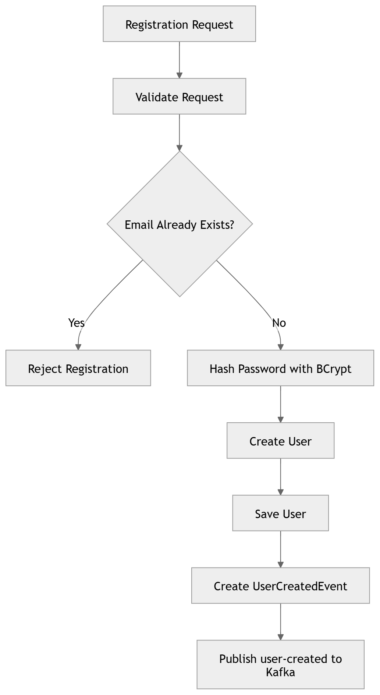
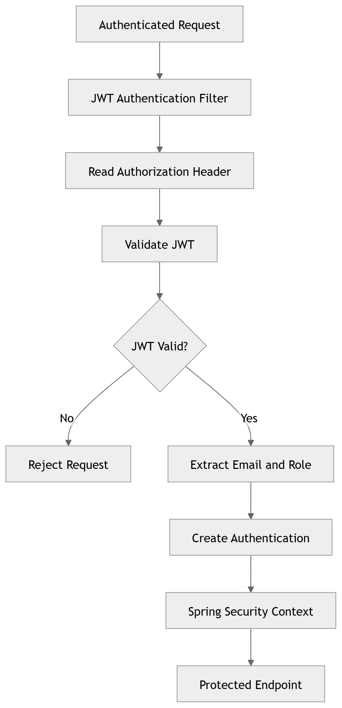
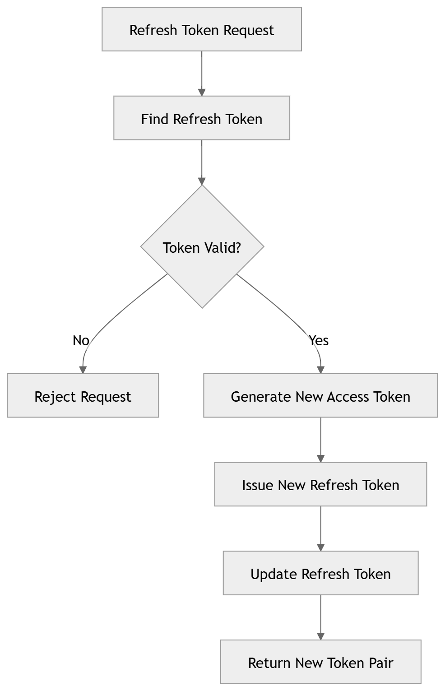
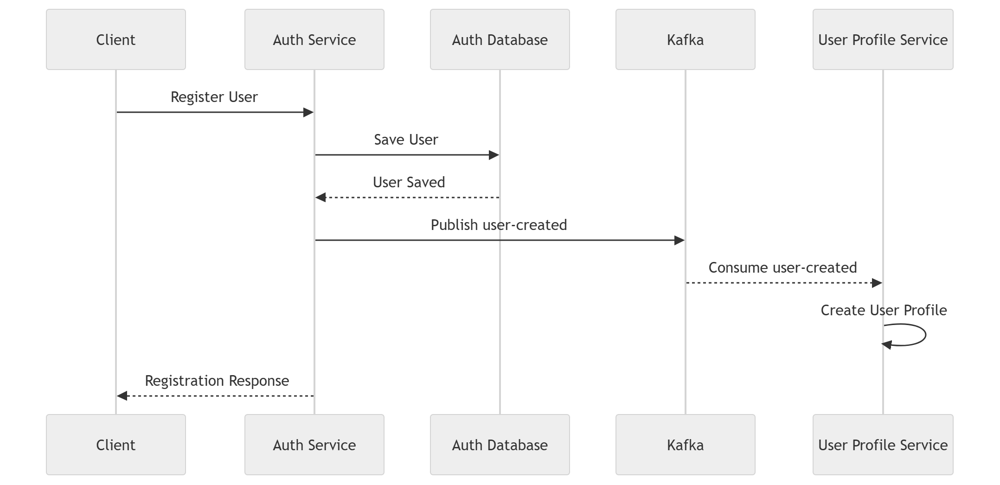
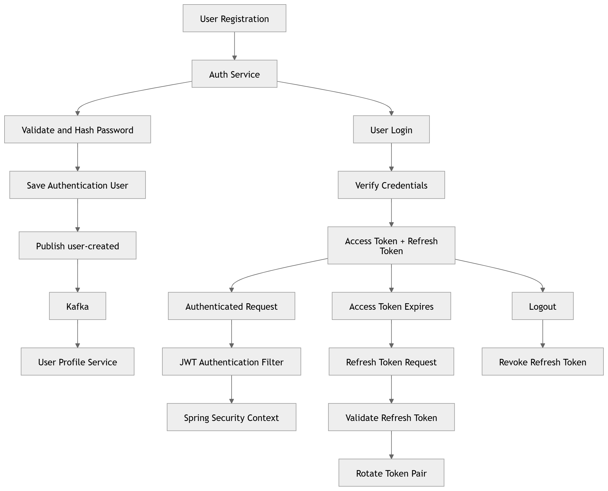

# Auth Service

The **Auth Service** is responsible for authentication and identity management in the food delivery application. It manages user registration, login, JWT-based authentication, refresh-token lifecycle, logout, and publishing user-creation events for downstream services.

The current public registration flows support three user types:

* Customer
* Restaurant Owner
* Delivery Partner

> 🚧 **Development Status**
>
> The service is part of an actively evolving application, so its functionality and integrations may change as new requirements are introduced.
---

## Overview

The Auth Service acts as the authentication boundary of the application.

It is responsible for:

* Creating authentication users
* Validating registration and login credentials
* Securely storing passwords using BCrypt
* Generating JWT access tokens
* Managing refresh tokens
* Authenticating requests using JWT
* Managing user roles
* Publishing `user-created` events through Kafka

The service currently uses H2 for persistence and Apache Kafka for asynchronous user-creation communication.

---

## Technology Stack

* Java
* Spring Boot
* Spring Security
* Spring Data JPA
* Spring Validation
* JWT
* Apache Kafka
* H2 Database
* Maven
* Lombok
* Spring Boot Actuator

---

## Role in the Application

The Auth Service is responsible for authentication and identity management. It owns authentication-related user information and credentials, while other services maintain their own service-specific user data.

Its primary responsibilities are:

1. **Authenticate users and provide token-based access to the application.**
2. **Publish user-creation events so downstream services can create related user data.**
---

## User Registration

The Auth Service provides separate registration flows for each supported user type.

### Registration Endpoints

| User Type        | Endpoint                         | Assigned Role      |
| ---------------- | -------------------------------- | ------------------ |
| Customer         | `POST /auth/customer/register`   | `CUSTOMER`         |
| Restaurant Owner | `POST /auth/restaurant/register` | `RESTAURANT_OWNER` |
| Delivery Partner | `POST /auth/delivery/register`   | `DELIVERY_PARTNER` |

All three registration flows follow the same general process.

<p align="center">
  
</p>


During registration, the service:

1. Validates the request.
2. Checks whether the email is already registered.
3. Hashes the password using BCrypt.
4. Creates the user with the appropriate role.
5. Persists the authentication user.
6. Creates a `UserCreatedEvent`.
7. Publishes the event through Kafka.

---

## User Roles

The Auth Service supports the following roles:

* `ADMIN`
* `CUSTOMER`
* `RESTAURANT_OWNER`
* `DELIVERY_PARTNER`

> **Note:** The `ADMIN` role exists within the service but cannot be created through any public registration endpoint.  
> Admin users are manually added to the system (for example, via database scripts).

---

## Login

### Endpoint

`POST /auth/login`

The login flow authenticates a user using their email and password.

The service:

1. Finds the user using the supplied email.
2. Verifies the supplied password against the stored BCrypt hash.
3. Generates a JWT access token.
4. Issues a refresh token.
5. Returns the access token, refresh token, and user's role.

### Token Lifetime

| Token         |    Lifetime |
| ------------- |------------:|
| Access Token  | 30 seconds  |
| Refresh Token |      7 days |

These are the current configured values for the development environment.

---

## JWT Authentication

The service uses stateless JWT authentication for protected requests.

After login, the client sends the access token using:

```text
Authorization: Bearer <access-token>
```

The `JwtAuthenticationFilter` processes authenticated requests.

<p align="center">
  
</p>


The filter:

1. Reads the `Authorization` header.
2. Checks the Bearer token format.
3. Validates the JWT signature and expiration.
4. Extracts the user's email and role.
5. Creates the Spring Security authentication.
6. Stores the authentication in the security context.

The application uses stateless session management rather than maintaining authentication through server-side HTTP sessions.

---

## Refresh Token Flow

### Endpoint

`POST /auth/refresh`

Refresh tokens are persisted in the database and associated with their user.

The refresh process performs token validation and rotation.


<p align="center">
  
</p>

The service:

1. Looks up the supplied refresh token.
2. Verifies that it exists.
3. Checks that it has not been revoked.
4. Checks that it has not expired.
5. Generates a new access token.
6. Issues a new refresh token.
7. Updates the refresh-token information.
8. Returns the new token pair.

The current implementation therefore uses **refresh-token rotation** rather than continuing to use the same refresh token.

---

## Logout

### Endpoint

`POST /auth/logout`

Logout is implemented by revoking the supplied refresh token.

The refresh token's `revoked` state is changed to `true`.

A revoked refresh token can no longer be used to obtain a new access token.

---

## Current User

### Endpoint

`GET /auth/me`

This authenticated endpoint retrieves information from the current Spring Security authentication context.

It currently exposes:

* Authenticated user's email
* Granted authority / role

A valid JWT is required to access this endpoint.

---

## Kafka Integration

The Auth Service uses Kafka for asynchronous communication after successful user registration.

### User Creation Event

<p align="center">
  
</p>

The `user-created` event contains information required by the downstream profile service, including:

* Authentication user ID
* Full name
* Email
* Role
* Phone number

The User Profile Service consumes the event using its configured Kafka consumer group and creates the corresponding user profile.

---

## Persistence

The Auth Service currently uses **H2** with **Spring Data JPA**.

### Authentication User

The authentication user record contains information such as:

* ID
* Name
* Email
* Password
* Phone number
* Role

Email is unique and required.

Passwords are stored using BCrypt encoding rather than plain text.

### Refresh Token

Refresh-token information is persisted separately and contains:

* Token
* Associated user
* Expiry date
* Revoked state

The current implementation maintains a refresh-token record associated with the user and updates the existing record when a new refresh token is issued.

---

## Security

The Auth Service uses Spring Security with:

* Stateless session management
* JWT-based authentication
* Custom JWT authentication filter
* BCrypt password encoding
* Method-level security
* CSRF disabled

Authentication and registration endpoints are publicly accessible according to the current security configuration, while `/auth/me` requires a valid JWT.

---

## API Reference

The following endpoints are currently exposed by the Auth Service:

| Method | Endpoint                    | Purpose                                               |
| ------ | --------------------------- | ----------------------------------------------------- |
| `POST` | `/auth/customer/register`   | Register a customer                                   |
| `POST` | `/auth/restaurant/register` | Register a restaurant owner                           |
| `POST` | `/auth/delivery/register`   | Register a delivery partner                           |
| `POST` | `/auth/login`               | Authenticate a user and issue tokens                  |
| `POST` | `/auth/refresh`             | Rotate the refresh token and issue a new access token |
| `POST` | `/auth/logout`              | Revoke the refresh token                              |
| `GET`  | `/auth/me`                  | Retrieve the current authenticated user's details     |

The README intentionally keeps the API reference concise. Detailed request/response specifications can be maintained through the project's API documentation/OpenAPI configuration rather than duplicating them here.

---

## Authentication Lifecycle

The major authentication flows can be viewed together as:


<p align="center">
  
</p>

